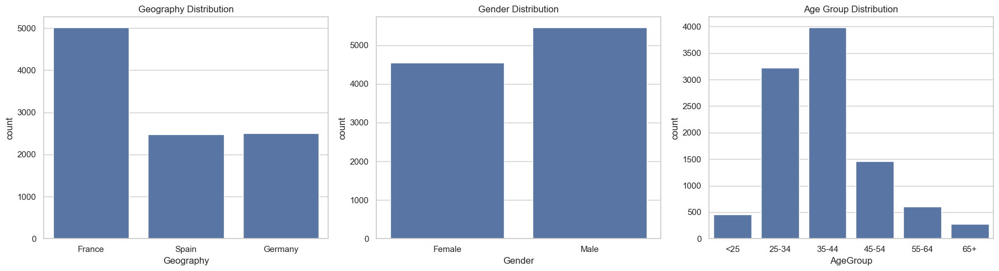
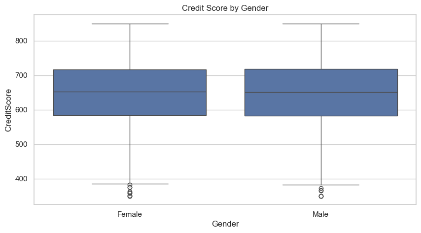
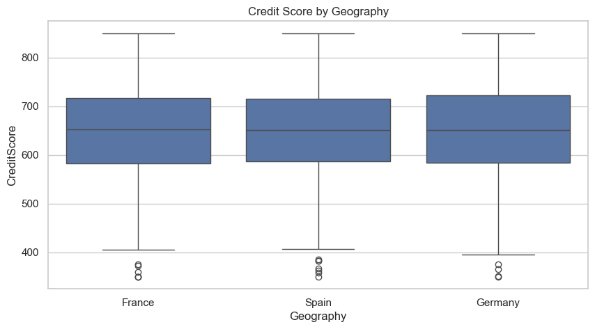
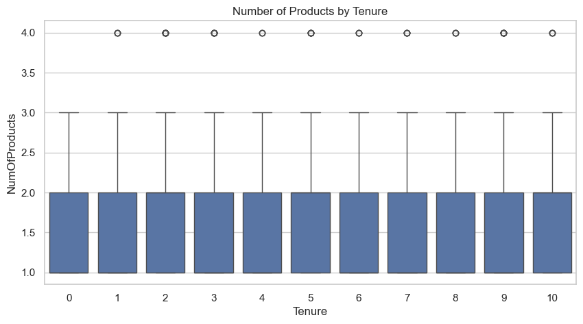

# Bank Customer Analysis – Final Data Analysis Project

## 📊 Project Overview

This project analyzes a bank's customer dataset to uncover insights on demographics, engagement, financial behavior, and churn (exited customers). The analysis helps the bank make informed decisions on customer retention, segmentation, and service optimization.

Data sources:
- `Customer_Info.csv` – contains demographic and salary info
- `Account_Info.csv` – contains account balances, product use, and churn status

---

## 🧹 Data Preparation

- **Merged** `Customer_Info` and `Account_Info` using `CustomerId`.
- **Removed** duplicate records and extra `Tenure` column.
- **Cleaned** currency fields (`Balance`, `EstimatedSalary`) and converted to numerical.
- **Grouped** ages into defined ranges (e.g., 25–34, 35–44).
- **Dropped** `CustomerId` to anonymize the dataset.

---

## 📌 Analysis Summary

### 1. Demographic Analysis
- **Gender & Geography Distribution**: Gender is evenly split; customers are mostly from **France, Spain, and Germany**.
- **Age Distribution**: The **35–44** age group is the most common.

- **Credit Score**:
  - Men and women have similar median scores.
  - Geography has a stronger influence; **German customers** showed higher median scores.
  
  

### 2. Customer Engagement Patterns
- Customers with **longer tenure** tend to:
  - Own more products.
  - Be slightly more engaged (based on `IsActiveMember`).
- **Credit card ownership** does not significantly increase with tenure.



### 3. Financial Performance
- **Credit Scores**:
  - Stable across age groups, though older customers have slightly wider distributions.
- **Balances**:
  - Tend to increase with age.
  - **35–54 age group** holds the highest balances.
- **Estimated Salary**: Fairly uniform across age groups, showing no strong correlation.

### 4. Exited Customers Analysis
- **Exited customers** are more likely to:
  - Be aged **45–54**, or over 55.
  - Have **higher balances**.
  - Have **lower credit scores** on average.
- Younger, lower-balance customers are less likely to churn.

### 5. Customer Segmentation
- Customers split into:
  - **High balance**: Tend to have higher estimated salaries and are slightly older.
  - **Low balance**: More spread across age and salary levels.
- These segments could benefit from **tailored financial products**.

---

## ✅ Conclusions & Recommendations

- **Retention Strategy**:
  - Focus on **high-balance, older customers**, especially those nearing 10-year tenure.
  - Investigate why high-balance users are exiting; possibly a lack of premium product offerings.

- **Product Offering**:
  - Consider segment-based marketing:
    - **Young adults**: Offer starter packages.
    - **Middle-aged professionals**: Cross-sell investment and premium banking tools.

- **Credit Risk Management**:
  - Monitor lower credit score individuals who also have high balances — possible default risk.

- **Geography Optimization**:
  - Customize offers by geography—especially where credit and salary behavior differ (e.g., Germany vs Spain).

---

## 📂 How to Run

1. Ensure the CSV files `Customer_Info.csv` and `Account_Info.csv` are in the working directory.
2. Install required libraries:
   ```bash
   pip install pandas matplotlib seaborn
